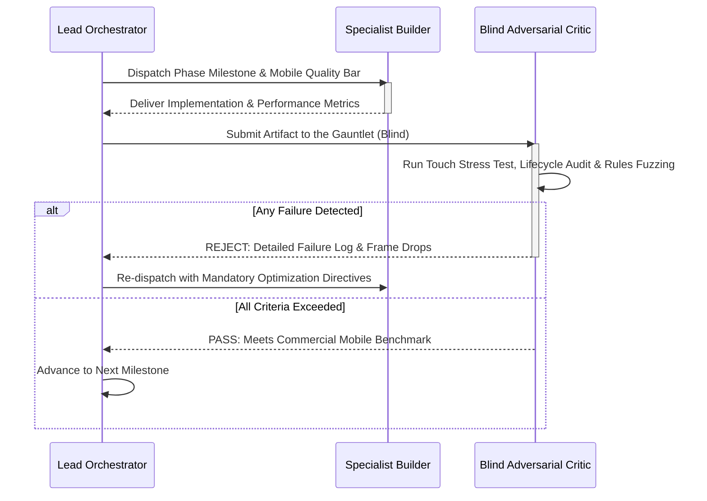

# Kamisado Android App — Autonomous Gauntlet Loop Specification

```
   ┌─────────────────────────────────────────────────────────────────┐
   │           KAMISADO ANDROID APP: GAUNTLET LOOP HARNESS           │
   │      Autonomous Build • Blind Critique • Relentless Iteration   │
   └─────────────────────────────────────────────────────────────────┘
                                   │
         ┌─────────────────────────┼─────────────────────────┐
         ▼                         ▼                         ▼
  [ Lead Architect ]     [ Specialist Builders ]    [ Harsh Blind Critics ]
  • Mobile Roadmap       • Touch, Haptics, Offline  • Tactile Feel & Edge Cases
```

---

## 1. Gauntlet Loop Methodology Overview

The **Gauntlet Loop** is an autonomous AI agentic engineering framework (popularized by Matt Shumer) that shifts development from manual prompting to an **uncompromising, self-refining loop**.

For the Android Mobile App, the loop focuses on physical touch craftsmanship, battery efficiency, offline-first reliability, and ergonomic excellence across phones, foldables, and tablets. Specialist builders implement mobile features while **adversarial blind critics** stress-test the build against real-world benchmarks (e.g., Bad North touch feel, Polytopia fluidity, Chess.com mobile reliability).

---

## 2. Quality Benchmark & Reference Bar

Any feature built in this loop must satisfy these non-negotiable benchmarks:
1. **Tactile Craftsmanship (Polytopia / Bad North Standard)**: Drag-and-drop and tap-to-move gestures must feel instantaneous. Haptic clicks must tick subtly over valid landing squares and deliver a solid snap on release.
2. **Tabletop Ergonomics (Face-to-Face Play)**: When placed flat on a table, the 180° inverted opponent UI must allow both players to read timers, names, and piece states comfortably without moving the device.
3. **Flawless Offline State Preservation**: Incoming phone calls, notifications, or sudden app backgrounding must never lose match progress. Reopening the app must restore the exact piece positions within 500ms.
4. **100% Kamisado Rule Integrity**: Strict enforcement of forward-only moves, color-forcing locks, stymie passing, deadlock adjudication, and multi-tier Sumo pushing mechanics.

---

## 3. Agent Roles & Architecture

### A. The Lead Orchestrator
* Decomposes the approved `PLAN.md` into atomic mobile modules.
* Manages sub-agent delegation, validates memory/battery impact, and enforces the critic's verdict.

### B. Specialist Builders
* **Builder 1: Touch & Haptics Engine**
  * Responsible for fluid drag-and-drop tracking, tap-to-move suggestions, boundary collision detection, and low-latency haptic feedback pulses (drag ticks, release snaps, heavy Sumo push vibrations).
* **Builder 2: Tabletop & Form-Factor Engine**
  * Responsible for portrait one-thumb navigation, landscape tabletop view with dual-facing inverted UI, and responsive scaling across smartphones, foldables, and tablets.
* **Builder 3: Campaign & Offline Progression Engine**
  * Responsible for *"The Dragon's Ascent"* 50+ level campaign, daily puzzle caching, offline AI skirmish bots (5 difficulty levels), and local save states.
* **Builder 4: Asynchronous Cloud & Notifications Engine**
  * Responsible for Google Play Games authentication, cloud save synchronization, and native Android push notifications for correspondence turns.

### C. Harsh Blind Critics (Adversarial Evaluators)
Critics evaluate the build output **blind** against high-stress mobile conditions:
* **Critic 1: The Tactile & Ergonomics Inspector**
  * *The Gauntlet*: Tests drag smoothness, checks for accidental drop misfires near tile borders, evaluates thumb reachability in portrait mode, and verifies that the inverted UI in Tabletop mode is legible and intuitive.
* **Critic 2: The Offline Resilience & Lifecycle Auditor**
  * *The Gauntlet*: Simulates airplane mode, sudden background kills, incoming phone calls, and battery saver throttling. Verifies that zero state is lost and memory usage remains minimal.
* **Critic 3: The Rules & Edge-Case Validator**
  * *The Gauntlet*: Fuzzes the engine with edge cases (cyclic stymie passes, pushing on baselines, diagonal push attempts) to guarantee zero deviation from official Burley Games rules.

---

## 4. The Gauntlet Cycle (Loop Flow)



---

## 5. Copy-Pasteable Prompt to Run the Gauntlet Loop

Use the prompt below to trigger the autonomous Gauntlet Loop for this project:

```text
================================================================================
AUTONOMOUS GAUNTLET LOOP PROMPT: KAMISADO ANDROID MOBILE APP
================================================================================

YOU ARE THE LEAD ARCHITECT IN AN AUTONOMOUS GAUNTLET LOOP.
YOUR OBJECTIVE: Build the "Kamisado Android Mobile App" according to the approved 
specifications in PLAN.md to commercial-grade, Polytopia-level tactile quality.

OPERATING RULES:
1. DECOMPOSE & BUILD: Break each phase from PLAN.md into atomic mobile modules. Use 
   specialist sub-agents to construct touch/haptic systems, tabletop mode, offline AI, 
   and the single-player campaign.
2. ADVERSARIAL BLIND CRITIC: After every build cycle, summon an independent, harsh 
   critic to evaluate the output against Peter Burley's official rules and modern 
   mobile UX standards (60 FPS touch tracking, haptic clarity, instant app resume).
3. THE QUALITY GAUNTLET:
   - Does piece dragging feel weighted, with haptic ticks on valid tiles and a snap on release?
   - Does Tabletop Mode properly flip opponent UI 180° for comfortable face-to-face play?
   - Are Stymie (Pass) and Deadlock (last mover loses) strictly enforced?
   - Do Sumo pushes work strictly orthogonal-forward, never on the home row, with proper 
     movement limits (Sumo: 5, Double: 3, Triple: 1)?
   - Does the app save and restore state instantly when interrupted by phone calls or closed?
4. REJECTION & SELF-CORRECTION: If the critic identifies ANY touch lag, rule hallucination, 
   or UI scaling flaw on different screens, REJECT the build immediately. Diagnose, 
   fix, and re-run the gauntlet until 100% compliance is achieved.
5. NO HALF-MEASURES: Do not stop or ask for user intervention on routine bug fixes. 
   Drive the loop autonomously until the target phase is fully delivered and verified.
================================================================================
```
