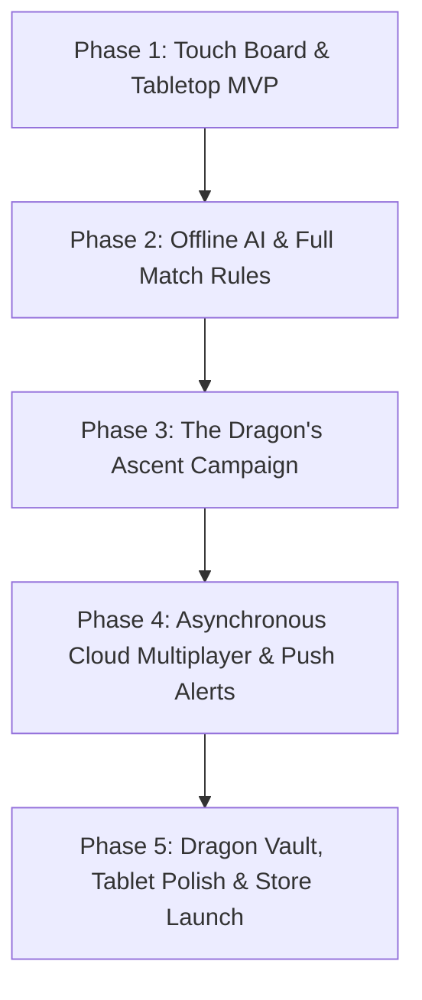

# Kamisado Android Mobile App — Comprehensive Product Vision & Phased Plan

```
   ┌─────────────────────────────────────────────────────────────┐
   │             KAMISADO ANDROID MOBILE APP                     │
   │  Tactile Mastery • Offline Campaign • Pocket Strategy       │
   └─────────────────────────────────────────────────────────────┘
```

---

## 1. Executive Summary & Product Vision

The **Kamisado Android Mobile App** is designed as a **luxurious, tactile pocket companion** that transforms an Android smartphone or tablet into a physical, weighted Kamisado board you can carry everywhere.

### The Vision
To deliver an authentic, sensory-rich board game experience optimized for mobile ergonomics. Whether laid flat on a coffee shop table for face-to-face play, enjoyed single-handedly during a subway commute, or played asynchronously across days via push notifications, the app combines physical craftsmanship with deep digital convenience.

### Core Experience Pillars
1. **Physicality & Tactile Craftsmanship**: Every touch matters. The app utilizes nuanced haptic feedback to communicate moves, piece drag states, and Sumo pushes. When a piece is released onto a valid square, a crisp wooden "thud" and haptic pulse mimic real tabletop components.
2. **Offline-First Reliability**: Complete independence from network connectivity. Players can experience the full single-player campaign, pass-and-play matches, and AI skirmishes while on airplanes, remote trails, or subways without losing progress.
3. **Ergonomic Mobility & Tabletop Adaptation**: Thoughtfully engineered for both one-thumb portrait navigation and an inverted two-player tabletop mode that turns any tablet or phone into a shared face-to-face board.

---

## 2. Target Audience & Personas

* **Persona 1: The Commuter & Travel Tactician ("David")**
  * *Context*: Travels on subways or flights without reliable internet.
  * *Needs*: Quick 2-to-5-minute solo puzzle levels, instant-resume offline play that saves state automatically when switching apps or taking a phone call, battery efficiency.
* **Persona 2: The Café Tabletop Pair ("Chloe & Liam")**
  * *Context*: Friends or partners sitting across from each other at a coffee shop table.
  * *Needs*: A digital board laid flat between them, with opponent UI elements flipped 180° so both players can read timers and piece indicators from their own perspective without passing the device back and forth.
* **Persona 3: The Asynchronous Tactician ("Kenji")**
  * *Context*: Busy professional who loves deep strategy but doesn't have 20 continuous minutes for real-time blitz.
  * *Needs*: Ongoing correspondence games (24h to 48h per move) with reliable Android push notifications alerting him when it's his turn.

---

## 3. Screen-by-Screen UX & Wireframe Flows

### A. The Dojo Hub (Main Menu)
* **Single Player Gateway**:
  * *"The Dragon's Ascent"* (Story Campaign).
  * *"Daily Challenge"* (Curated daily tactical puzzle).
  * *"AI Skirmish"* (Quick battle against local bot).
* **Tabletop Mode (Pass & Play)**:
  * Instant access to 2-player local play with one tap.
* **Online Arena**:
  * Asynchronous Game Drawer (shows cards of active correspondence matches with turn timers).
  * Quick Match queue for real-time mobile blitz.
* **The Dragon Vault**:
  * Cosmetic trophy room and customizable piece/board finishes.

### B. The Battlefield (In-Game Screen)
* **Portrait Mode (One-Handed Play)**:
  * Board occupies the central viewport with touch targets scaled comfortably for thumbs.
  * Faint luminous guiding lines indicate legal forward and diagonal trajectories when touching a piece.
  * Bottom dock displays current player timer, active color banner, and undo/menu controls.
* **Tabletop Mode (Face-to-Face Play)**:
  * Pieces, clocks, and score displays on the opponent’s side are flipped 180°.
  * Both players see their names, captured ring trays, and move prompts upright from their respective sides of the table.
* **Sensory Feedback**:
  * Light haptic vibrations tick as a piece glides over valid tiles.
  * Crisp tactile click upon releasing a piece onto a legal square.
  * Heavy dual-pulse vibration when executing a Sumo Push.

### C. "The Dragon's Ascent" (Campaign Map)
* An illustrated thematic journey across 8 elemental shrines:
  1. *Shrine of Earth (Brown)*: Basic forward momentum and blocking.
  2. *Shrine of Water (Blue)*: Diagonal flow and navigation.
  3. *Shrine of Wood (Green)*: Color entrapment and stymie basics.
  4. *Shrine of Sun (Yellow)*: Long-range attacks and perimeter play.
  5. *Shrine of Blossom (Pink)*: Deceptive sacrificial lines.
  6. *Shrine of Fire (Red)*: High-tempo forcing chains.
  7. *Shrine of Shadow (Purple)*: Deadlock avoidance and reverse traps.
  8. *Shrine of the Dragon (Orange)*: Master duels with Sumo handicaps.
* Each shrine features 6–8 puzzle stages with unique victory conditions.

### D. Asynchronous Correspondence Drawer
* Clean, unified list of ongoing games:
  * Opponent avatar, user rating, and current board thumbnail.
  * Badge indicating *"Your Turn"* or *"Waiting for Opponent"*.
  * Turn countdown clock (e.g., *"14h remaining"*).

---

## 4. Comprehensive Feature Specifications

### A. Mobile-Optimized Game Modes
* **Tabletop Pass & Play (Face-to-Face)**:
  * Dual-facing UI for two players seated across from one another.
  * Optional "Move Confirmation" toggle to prevent accidental touches.
  * Integrated Sumo ring tray displaying earned rings between rounds.
* **The Dragon's Ascent Campaign**:
  * 50+ hand-crafted puzzle stages with three-star mastery ratings.
  * Special rule scenarios (e.g., reach the baseline in under 4 moves, win while opponent begins with a Sumo tower).
* **Offline AI Skirmish**:
  * 5 discrete difficulty levels running entirely on-device with zero battery drain.
  * State preservation: automatically saves move state when a phone call interrupts play.

### B. Mobile Multiplayer & System Integration
* **Push-Notification Asynchronous Duels**:
  * Native Android push notifications alert players when their opponent moves (*"Elena just moved her Green Tower! It's your turn."*).
  * Support for maintaining 5–10 simultaneous casual games with friends.
* **Live Mobile Blitz**:
  * Fast 3-minute real-time matchmaking when connected to mobile data or Wi-Fi.
* **Local Bluetooth / Wi-Fi Direct Play**:
  * Wireless head-to-head play between two Android devices without internet (ideal for flights or outdoor trips).

### C. Sensory & Mechanical Craftsmanship
* **Advanced Haptic Engine**:
  * Light rumble on drag over valid squares.
  * Crisp snap on tile lock-in.
  * Heavy resonance pulse on Sumo pushes.
* **Adaptive Form Factors**:
  * Responsive layout transitioning seamlessly between phones, large tablets, and foldables (e.g., Samsung Galaxy Z Fold expanding into full tabletop mode).
* **Battery & Performance Efficiency**:
  * OLED true-black theme option to preserve battery life.
  * Adaptive framerate scaling down to 30 FPS when the board is idle.

### D. The Dragon Vault (Progression & Customization)
* **Mastery Journey**:
  * Unlock color mastery badges for winning moves performed by specific towers.
* **Unlockable Aesthetics (Zero Pay-to-Win)**:
  * *Piece Materials*: Carved Jade, Polished Mahogany, Matte Obsidian, Imperial Gold, Frosted Porcelain.
  * *Board Surfaces*: Traditional Tatami, Ancient Slate, River Pebble, Golden Palace.
  * *No Stat Boosts*: Strictly cosmetic progression earned through campaign completion and puzzle streaks.

---

## 5. Phased Implementation Roadmap



### Phase 1: Touch Board & Tabletop MVP
* **Primary Objective**: Deliver a physical-feeling, responsive touch Kamisado board on mobile.
* **Key Deliverables**:
  * Smooth touch drag-and-drop and tap-to-select piece controls.
  * Integrated haptic feedback on piece release and valid moves.
  * Face-to-Face 2-Player Pass & Play mode with dual-facing inverted UI.
  * Pure Single-Round rules engine with legal move highlighting.
  * Portrait and landscape screen rotation support.

### Phase 2: Offline AI & Full Match Rules
* **Primary Objective**: Bring full match rules and reliable offline play to mobile.
* **Key Deliverables**:
  * Standard (3 pts), Long (7 pts), and Marathon (15 pts) match modes.
  * Sumo rings, Sumo pushes, and push restrictions.
  * On-device local AI with 4 difficulty levels.
  * Automatic state preservation (phone calls or switching apps never loses match progress).
  * Colorblind symbols and high-contrast accessibility toggles.

### Phase 3: "The Dragon's Ascent" Campaign & Puzzles
* **Primary Objective**: Provide world-class single-player content with high player retention.
* **Key Deliverables**:
  * 50+ level campaign mode across 8 elemental shrines with progressive difficulty.
  * Daily puzzle engine with offline local caching.
  * Interactive animated tutorial for beginners.
  * Sound effects: tactile wooden piece clacks, taiko drums, and relaxing flute soundtracks.

### Phase 4: Asynchronous Cloud Multiplayer & Push Alerts
* **Primary Objective**: Connect mobile players worldwide with mobile-friendly pacing.
* **Key Deliverables**:
  * Google Play Games authentication and cloud save sync across devices.
  * Asynchronous correspondence matches (24h/48h turn limits).
  * Native Android push notifications for move reminders and game invites.
  * Real-time mobile matchmaking queue.
  * In-game friends list and invite codes.

### Phase 5: The Dragon Vault, Tablet Polish & Store Launch
* **Primary Objective**: Commercial-grade visual polish and Google Play Store release.
* **Key Deliverables**:
  * The Dragon Vault: unlockable board surfaces, tower carvings, and dragon emblems.
  * Google Play Store achievements (30+ milestones) and leaderboards.
  * Large tablet and foldable phone layout optimization.
  * OLED dark theme battery conservation mode.
  * Production release on the Google Play Store.
