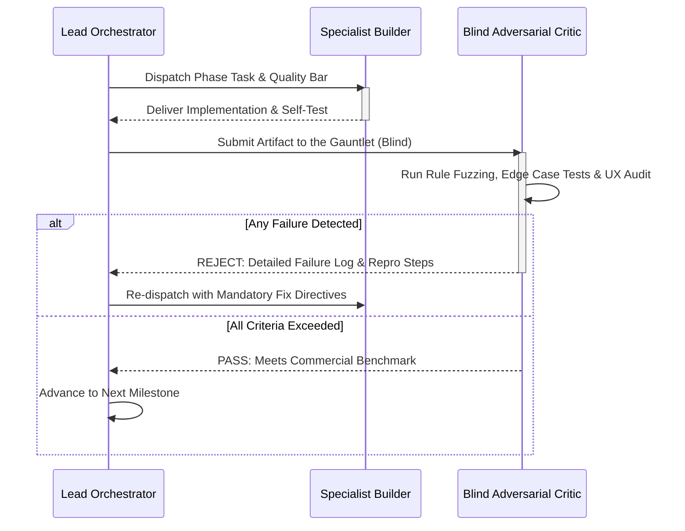

# Kamisado Online Web App — Autonomous Gauntlet Loop Specification

```
   ┌─────────────────────────────────────────────────────────────────┐
   │             KAMISADO WEB APP: GAUNTLET LOOP HARNESS             │
   │      Autonomous Build • Blind Critique • Relentless Iteration   │
   └─────────────────────────────────────────────────────────────────┘
                                   │
         ┌─────────────────────────┼─────────────────────────┐
         ▼                         ▼                         ▼
  [ Lead Architect ]     [ Specialist Builders ]    [ Harsh Blind Critics ]
  • Backlog & Phases     • Rules, UI, Networking   • Edge Cases & Benchmarks
```

---

## 1. Gauntlet Loop Methodology Overview

The **Gauntlet Loop** is an autonomous AI agentic engineering framework (popularized by Matt Shumer) that shifts development from micro-managed manual prompting to an **uncompromising, self-refining loop**. 

Instead of accepting "good enough" code, the lead agent drives specialist builders to construct features, while **adversarial, blind critics** evaluate the output against uncompromising real-world benchmarks (e.g., Lichess.org reliability, BoardGameArena smoothness, 100% strict Burley Games rule fidelity). If any requirement fails, the work is rejected and automatically refined until it passes the gauntlet.

---

## 2. Quality Benchmark & Reference Bar

Any feature built in this loop must be judged against the following standards:
1. **Lichess / Chess.com Responsiveness**: Zero visual jitter, smooth 60 FPS piece slide transitions, instant 1-click room joining (`kamisado.gg/play/room-xyz`) without mandatory registration.
2. **Absolute Mathematical Rule Fidelity**: Zero tolerance for rule hallucinations. Exact implementation of Peter Burley's 8×8 Latin-square board, color-forcing movement, pass (stymie) automation, deadlock resolution (last mover loses), and multi-tier Sumo pushing physics.
3. **Accessibility & Sensory Elegance**: Full colorblind symbol assist, crisp wooden piece audio, and responsive layout across desktop and mobile browsers.

---

## 3. Agent Roles & Architecture

### A. The Lead Orchestrator
* Decomposes the approved `PLAN.md` into discrete implementation milestones.
* Maintains strict state tracking and guards the codebase against regressions.
* Manages sub-agent handoffs and enforces the critic's verdict.

### B. Specialist Builders
* **Builder 1: Rules & Game State Machine**
  * Responsible for pure, deterministic board representations, valid forward/diagonal move generation, obstruction detection, color-lock enforcement, stymie passing, deadlock detection, and Sumo push logic.
* **Builder 2: Board Presentation & Visual FX**
  * Responsible for the 8×8 board renderer, smooth piece animations, 180° perspective flipping, dragon motif tower SVG/Canvas components, and colorblind symbol layers.
* **Builder 3: Real-Time Networking & Matchmaking**
  * Responsible for 1-click room creation, WebSocket/WebRTC synchronization, reconnect grace timers, turn clocks (Blitz, Rapid), and fair-play surrender detection.
* **Builder 4: AI Dojo & Solo Bot Engine**
  * Responsible for minimax / heuristic bot engines (Apprentice, Ronin, Dragon Master) and the daily puzzle solver.

### C. Harsh Blind Critics (Adversarial Evaluators)
Critics review the final built artifact **blind** (evaluating only running output and code quality, without bias from builder explanations):
* **Critic 1: The Kamisado Grandmaster (Rules & Edge Cases)**
  * *The Gauntlet*: Deliberately tries to break the rules engine. Attempts backward moves, sideways moves, jumping, pushing on home rows, pushing diagonally, creating artificial deadlock chains, and verifying that the player who created the deadlock is correctly flagged as the loser.
* **Critic 2: The Performance & Network Auditor**
  * *The Gauntlet*: Audits bundle size, checks for memory leaks during rapid piece drags, simulates 250ms network packet loss/disconnections, and tests clock synchronization accuracy.
* **Critic 3: The UX & Accessibility Inspector**
  * *The Gauntlet*: Verifies one-handed mobile touch response, keyboard accessibility, high-contrast and symbol clarity for all 8 colors, and ensures joining a match takes under 3 clicks from initial page load.

---

## 4. The Gauntlet Cycle (Loop Flow)



---

## 5. Copy-Pasteable Prompt to Run the Gauntlet Loop

Use the prompt below to trigger the autonomous Gauntlet Loop for this project:

```text
================================================================================
AUTONOMOUS GAUNTLET LOOP PROMPT: KAMISADO ONLINE WEB APP
================================================================================

YOU ARE THE LEAD ARCHITECT IN AN AUTONOMOUS GAUNTLET LOOP.
YOUR OBJECTIVE: Build the "Kamisado Online Web App Game" according to the approved 
specifications in PLAN.md to commercial-grade, Lichess-level quality.

OPERATING RULES:
1. DECOMPOSE & BUILD: Break each phase from PLAN.md into atomic modules. Use specialist 
   sub-agents to construct the rules engine, UI renderer, and room networking.
2. ADVERSARIAL BLIND CRITIC: After every build cycle, summon an independent, harsh 
   critic to evaluate the output against Peter Burley's official rules and modern web 
   standards (60 FPS, <2s load, zero desync).
3. THE QUALITY GAUNTLET:
   - Does it enforce forward-only (straight/diagonal) moves with zero jumping?
   - Does the color of the landing square strictly force the opponent's next piece?
   - Are Stymie (Pass) and Deadlock (last mover loses) correctly handled?
   - Do Sumo pushes work strictly orthogonal-forward, never on the home row, and with 
     proper distance restrictions (Sumo: 5, Double: 3, Triple: 1)?
   - Is there a universal colorblind symbol mode and tactile audio feedback?
4. REJECTION & SELF-CORRECTION: If the critic identifies ANY edge-case failure, 
   regression, or visual stutter, REJECT the build immediately. Diagnose the root 
   cause, fix it, and re-run the gauntlet until 100% compliance is achieved.
5. NO HALF-MEASURES: Do not stop or ask for user intervention on routine bug fixes. 
   Drive the loop autonomously until the target phase is fully delivered and verified.
================================================================================
```
