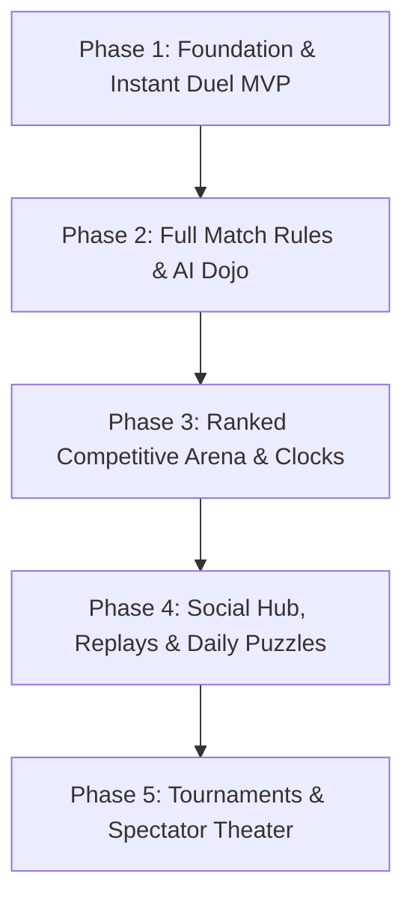

# Kamisado Online Web App Game — Comprehensive Product Vision & Phased Plan

```
   ┌─────────────────────────────────────────────────────────────┐
   │             KAMISADO ONLINE WEB APPLICATION                 │
   │  Instant Access • Zero-Install • Global Competitive Arena   │
   └─────────────────────────────────────────────────────────────┘
```

---

## 1. Executive Summary & Product Vision

The **Kamisado Online Web App Game** is designed to be the premier, frictionless digital gateway to Peter Burley’s acclaimed abstract strategy board game. 

### The Vision
To deliver a universal, browser-based gaming experience that requires **zero installation**, zero barrier to entry, and allows any two players across the globe to begin an intellectual duel within seconds of sharing a web link. It blends an authentic Japanese/Zen aesthetic with modern, responsive web technology to serve both casual duelists and competitive ranked players.

### Core Experience Pillars
1. **Frictionless & Instant Play**: No mandatory account registration or app downloads. One click creates a game room with a clean, shareable URL (`kamisado.gg/play/room-xyz`) that immediately seats the opponent upon opening.
2. **Zen-Minimalist Visual Identity**: Rich lacquered mahogany surfaces, polished stone tiles, Japanese brush calligraphy accents, and smooth piece slide transitions that respect the focus and depth of abstract strategy gaming.
3. **Competitive Rigor & Spectator Hub**: Professional time controls (Blitz, Rapid, Classical), ELO-rated matchmaking, live spectator lounges with low-latency broadcasts ("Kamisado TV"), and post-match interactive replay analysis.

---

## 2. Target Audience & Personas

* **Persona 1: The Casual Coffee-Break Duelist ("Alex")**
  * *Context*: Wants a quick 5-to-10-minute game with a colleague or friend over lunch.
  * *Needs*: Instant link generation, zero login requirements, intuitive drag-and-drop or click-to-move controls, clear visual cues showing which piece must move next.
* **Persona 2: The Ranked Ladder Competitor ("Elena")**
  * *Context*: Experienced chess, Go, or Shogi player looking for deterministic, zero-luck strategy games.
  * *Needs*: Strict ELO matchmaking, transparent disconnect and rage-quit protection, clock timers with increments, deep match history, and opening move analytics.
* **Persona 3: The Board Game Streamer & Educator ("Marcus")**
  * *Context*: Hosts community game nights on Twitch or YouTube.
  * *Needs*: Spectator slots in custom rooms, clean broadcast-friendly overlays (OBS support), downloadable move notation records, and interactive puzzle setups.

---

## 3. Screen-by-Screen UX & Wireframe Flows

### A. The Welcome Pavilion (Home Lobby)
* **Hero Banner**: Atmospheric header featuring the iconic 8-colored dragon towers with subtle ambient particle animations.
* **Primary Call-to-Actions**:
  * **"Quick Duel" (Instant Matchmaking)**: Drops the user into the queue for a casual public game with an opponent of similar latency and skill.
  * **"Create Private Room"**: Opens a modal to configure match rules and generates an instant shareable link / QR code.
  * **"Practice with Bot"**: Instant solo skirmish against an AI dojo bot.
* **Live Arena Ticker**: Displays currently active top-rated games with one-click "Spectate" buttons.
* **Daily Puzzle Teaser**: A compact, interactive preview of the day’s "Mate-in-3" tactical puzzle.

### B. The Arena (In-Game Screen)
* **The 8×8 Latin-Square Board**:
  * Centered with automatic 180° perspective flip based on the player’s side (Gold or Black).
  * Smooth piece sliding animations with ghost trails highlighting previous moves.
  * Tile highlights indicating valid destination squares when a piece is selected or hovered.
* **Turn & Constraint Indicator**:
  * Prominent, elegant banner displaying whose turn it is.
  * Highlights the **active color constraint** with high contrast and symbol indicators.
  * Clocks displaying remaining time with visual warnings when under 30 seconds.
* **Side Panel / Tool Drawer**:
  * **Move History Log**: Move-by-move notation (e.g., `1. Black Brown -> c4`, `1... Gold Yellow -> f5`).
  * **Emote & Reaction Wheel**: Civil, non-toxic preset expressions (*"Well played"*, *"Thinking..."*, *"Respect"*, *"Checkmate"*).
  * **Room Controls**: Copy invite link, toggle spectator chat, resign, or offer a draw.

### C. The Academy (Tutorial & Practice Dojo)
* Step-by-step interactive lessons explaining:
  1. *The Dragon's Step*: Forward and diagonal movement limits.
  2. *The Color Lock*: The core mechanic of forced color movement.
  3. *The Stymie (Pass)*: What happens when a designated tower has no legal moves.
  4. *Deadlocks*: How cyclic blockages occur and why the last mover loses.
  5. *The Way of the Sumo*: Sumo rings, pushing mechanics, and match scoring.

### D. The Replay & Analysis Suite
* Full-featured match review interface with step-forward/backward slider.
* Export game notation in text format.
* "Play from this position" button to test alternative branches against an AI bot.

### E. Player Profile & Hall of Fame
* Detailed statistics: Win/loss record, current ELO tier, favorite winning tower color, average moves per match, and historical tournament trophies.

---

## 4. Comprehensive Feature Specifications

### A. Game Rules & Formats
* **Single Round (Casual)**: First player to reach the opponent’s baseline wins 1 point and takes the game.
* **Standard Match (First to 3 Points)**:
  * Winning towers earn octagonal **Sumo Rings**.
  * **Sumo Push**: Pushes an adjacent opposing tower straight backward 1 square into an empty tile (cannot push diagonally, and cannot push pieces on their home row).
  * Sumo movement handicap: max forward movement restricted to 5 squares.
* **Long Match (First to 7 Points) & Marathon (First to 15 Points)**:
  * Introduces **Double Sumos** (pushes up to 2 towers, max move 3 squares) and **Triple Sumos** (pushes up to 3 towers, max move 1 square).
* **Automatic Pass & Deadlock Resolution**:
  * Seamless pass automation when a forced piece is obstructed.
  * Instant deadlock adjudication according to official Burley Games tournament rules (the player who caused the deadlock loses).

### B. Matchmaking & Time Controls
* **Time Formats**:
  * *Blitz*: 1 minute + 2 seconds increment per move.
  * *Rapid*: 5 minutes + 5 seconds increment.
  * *Classical*: 15 minutes flat.
  * *Correspondence*: 24 or 48 hours per turn.
* **Competitive Tiers**:
  * *White Tower* (0–1000 ELO)
  * *Green Jade* (1001–1300 ELO)
  * *Bronze Dragon* (1301–1600 ELO)
  * *Silver Dragon* (1601–1900 ELO)
  * *Golden Dragon Master* (1900+ ELO)

### C. Accessibility & Sensory Design
* **Universal Colorblind Assist Mode**:
  * Every color features a distinct geometric or Kanji emblem (e.g., Mountain, Water, Lotus, Sun, Fire, Moon, Wind, Dragon) etched on both the board square and the tower cap.
* **Audio Identity**:
  * Authentic wooden piece slide and clack sound effects.
  * Subtle ceremonial chime on match victory.
  * Ambient traditional flute and rain acoustic soundscapes (toggleable).

---

## 5. Phased Implementation Roadmap



### Phase 1: Foundation & Instant Duel (MVP)
* **Primary Objective**: Deliver a flawless, browser-playable Single-Round Kamisado game in under 2 seconds load time.
* **Key Deliverables**:
  * High-performance 8×8 Latin-square responsive board with 180° perspective flip.
  * Pure Single Round rules engine (valid movement, obstruction checking, color-lock forcing, win detection).
  * Local Hotseat mode (2 players sharing one computer).
  * Instant 1-click shareable room links for 2-player remote web duels.
  * Colorblind symbol assist toggle and tactile wooden sound effects.

### Phase 2: Full Match Rules & AI Dojo
* **Primary Objective**: Implement the complete official Burley Games ruleset and solo training capabilities.
* **Key Deliverables**:
  * Full match formats: Standard (3 pts), Long (7 pts), and Marathon (15 pts).
  * Sumo rings, Sumo pushes, and distance restrictions.
  * Automatic Pass handling and Deadlock detection with official winner assignment.
  * AI Opponents with 3 distinct personalities: Apprentice (beginner), Ronin (intermediate), Dragon Master (advanced).
  * Interactive 5-stage Tutorial Academy.

### Phase 3: Ranked Competitive Arena & Clocks
* **Primary Objective**: Establish a reliable, secure competitive platform for serious players.
* **Key Deliverables**:
  * Optional user accounts (Google, Discord, or persistent Guest ID).
  * Ranked ladder matchmaking queue with ELO calculation.
  * Match clocks (Blitz, Rapid, Classical, Correspondence).
  * Disconnect grace period (60s reconnection window) and rage-quit protection.
  * Player profile showing match history and rank badges.

### Phase 4: Social Hub, Replays & Daily Puzzles
* **Primary Objective**: Drive community retention, tactical growth, and player connections.
* **Key Deliverables**:
  * Daily "Mate-in-X" puzzle engine with streak calendar and statistics.
  * Interactive move-by-move match replay viewer with notation export.
  * Friends list, online presence indicators, and direct duel invitations.
  * In-game civil emote wheel.
  * Seasonal global and regional leaderboards.

### Phase 5: Tournaments & Spectator Theater
* **Primary Objective**: Transform the web app into the premier esports and community hub for Kamisado.
* **Key Deliverables**:
  * Automated Swiss and Single-Elimination community tournament brackets.
  * "Kamisado TV" live spectator lounge with spectator chat.
  * Streamer mode featuring transparent overlays for OBS and Twitch broadcasts.
  * Unlockable board aesthetic themes (e.g., Cherry Blossom, Obsidian & Gold, Volcanic Slate).
